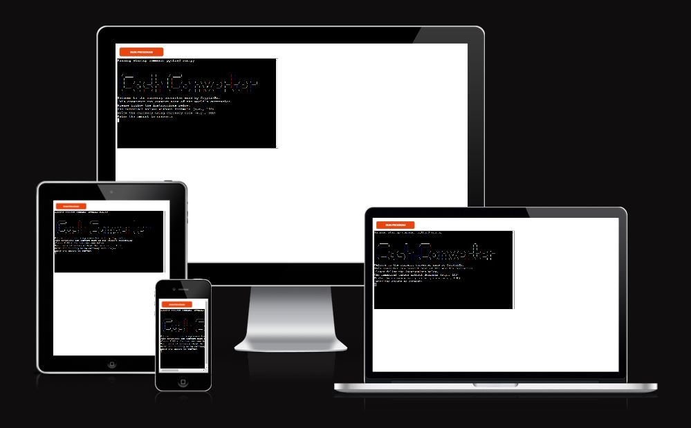
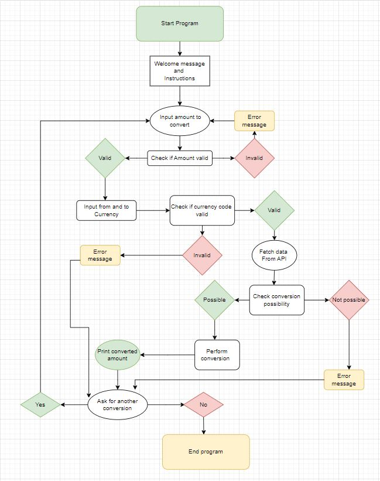
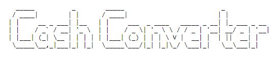
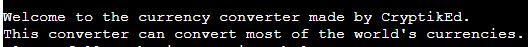
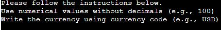
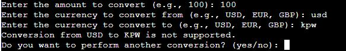
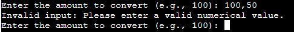
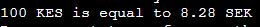

# Cash Converter

This Terminal based Cash Converter lets the user convert currency with up-to-date exchange rates. With its simple instructions, it lets the user intuitively navigate and use the converter with ease! 


[Link to live site](https://cash-converter-5ca8f5523a04.herokuapp.com/)




## Contents

- [Planning](#flowchart)

- [Design](#design)

- [UX](#ux)
    - [Program Goals](#program-goals)
    - [User Stories](#user-stories)

- [Features](#features)
    - [Existing Features](#existing-features)
    - [Future Features](#future-features)

- [Testing](#testing)
    - [Validation](#validation)

- [Deployment](#deployment)

- [Credits](#credits)

- [Acknowledgements](#acknowledgements)

## Flowchart

The following wireframe (created with [drawio](https://www.drawio.com/)) visualizes the planning process for this application.




## Design

As this is simple terminal based application, the design process for the user interface was limited.

It uses the terminals default design. The only applied feature is the logo displayed.


## UX

### Program Goals

The goal of this currency converter is to provide the user with a simple, easy-to-understand application.

### User Stories

**As a user I want to**

- Be able to convert currency at any time and any place.
- Have an easy-to-understand application. 
- Be able to input whichever currency i need.
- Be informed if my data input is not valid and why.
- Read whats required to utilise the currency converter.


**As a site administrator I want to**

- Be able to make modifications to the currency converter (see [future features](#possible-future-features))
- Offer the user a simple a currency converter.
- Utilise the converter myself.

## Features

## Existing Features
- Users can enter the amount they want to convert.
- User can enter the currency code from.
- User can enter the currency code to.
- Error message if user inputs wrong value.
- Allows user to make another conversion without restarting program.

**Logo**
- Displays Cash Converter title using ASCII.



**Welcome Message**
- Greets the user welcome.



**Introduction and Rules**
- Gives the user instructions and examples of what to input.




**Invalid Data Error**
- Tells the user which data type is required.
- Alerts user of invalid currency code or when letters are insterted instead of numerical values.
- Informs the user if input data was not valid.

  

  


**Currency conversion result**
- Outputs the amount user wants.




**Restart cash converter option**
- Offers user the choice to restart and convert new currency


### Future Features

- Impliment colors to display error messages.
- User can input amount with decimals.
- Better logo with colors.
- Error message that specifies which currency code is wrongly entered.
- Real-time currency conversion that updates every 5 minutes.
- Dropdown menu so user can select the currency.
- Mobile application version.
- Currency exchange rate trend analysis.
- Profile for user to save conversion history.


## Testing

The portal has been well tested and the results can be viewed [here - TESTING](TESTING.md)

## Validation

- HTML, CSS and JavaScript validation does not apply to this project. The template provided by Code Institute as provided to all students is assumed to be tested for the above.
No further change or manipulation of the template's default HTML, CSS and JavaScript files has been performed.

- Python Validator [PEP8]([http://pep8online.com/](https://pep8ci.herokuapp.com/#))


## Deployment

This project was deployed with Heroku using Code Institute's mock terminal as provided with the Python Essentials template.

To deploy:

- Clone or fork this public repository
- Create a Heroku account (if not already existing)
- Create a new app with Heroku
- In **Settings**, add 2 buildpacks:
    - ```Python```
    - ```NodeJS```
    
    Ensure the buildpacks are created in that order!

- Allowing Heroku access to GitHub, link the new app to the relevant repository
- Choose whether or not to enable **Automatic Deploys**. If enabled, the deployed app will update automatically with each push to GitHub
- Click **Deploy**

## Credits

- Tools to create logo [Text to ASCII Art Generator](https://patorjk.com/software/taag/#p=display&h=1&v=1&f=Big&t=Cash%20Converter).

- ExchangeRate-API for custom API key access [ExchangeRate-API](https://www.exchangerate-api.com/).

- ExchangeRate-API Document for setting up there api in python[ExchangeRate-API Docs](https://www.exchangerate-api.com/docs/python-currency-api).

- Turtle Code for tutorial on showing how to make a currency converter[Turtle Code youtube Tutorial](https://www.youtube.com/watch?v=isx6SpxZ4y0).

- Code institute LMS python essentials for teaching how to use while true functions[Link here](https://learn.codeinstitute.net/courses/course-v1:CodeInstitute+LS101+2021_T1/courseware/293ee9d8ff3542d3b877137ed81b9a5b/e3b664e16366444c8d722c5d8340b340/?child=first).

- Stackoverflow for solving long lines of code[Link here](https://stackoverflow.com/questions/45965007/multiline-f-string-in-python)

- W3schools for try and except keywords training[Link here](https://www.w3schools.com/python/python_try_except.asp).

- Stackabuse discussion for solving my error in the logo when not using r prefix[link here](https://stackabuse.com/the-u-and-r-string-prefixes-and-raw-string-literals-in-python/)

- Code institute love sandwich walkthrough project to help me build the structure of the code[Link here](https://learn.codeinstitute.net/courses/course-v1:CodeInstitute+LS101+2021_T1/courseware/293ee9d8ff3542d3b877137ed81b9a5b/58d3e90f9a2043908c62f31e51c15deb/)

- Flowchart drawing from drawio[Link here](https://www.drawio.com/)

- Christian Kangaji (backend developer and friend) for his guidance to solve a problem with the conversion result*user amount syntax. 


### Acknowledgements 

This terminal based application was developed as part of my project portfolio during my Fullstack Software Developer Diploma course. I would like to give a special thanks to my mentor Jubril and my tutor Kay for giving me helpful and insightful tips along the way. And a shout out to the slack community for many interesting and helpful posts. I also want to thank my childhood friend Christian Kangaji for his guidance and help when I have come across diffuculties in my coding, and a final thanks to my girlfriend who always listens and gives me motivation to keep pushing forward.

[Back to top](<#contents>)
---
