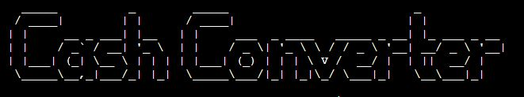

# Cash Converter

This Terminal based Cash Converter lets the user convert currency with up-to-date exchange rates. With its simple instructions, it lets the user intuitively navigate and use the converter with ease! 


[Link to live site](https://cash-converter-5ca8f5523a04.herokuapp.com/))


## Contents

- [Planning](#flowchart)

- [Design](#design)

- [UX](#ux)
    - [Program Goals](#program-goals)
    - [User Stories](#user-stories)

- [Features](#features)
    - [Existing Features](#existing-features)
    - [Future Features](#future-features)

- [Testing](#testing)
    - [Validation](#validation)

- [Deployment](#deployment)

- [Credits](#credits)
    - [Data](#data)
    - [Code](#code)


## Flowchart

The following wireframe (created with [drawio](https://www.drawio.com/)) visualizes the planning process for this application.


## Design

As this is simple terminal based application, the design process for the user interface was limited.

It uses the terminals default design.The only applied feature was the logo as i wanted it to be displayed.


## UX

### Program Goals

The goal of this converter is to provide the user with a simple, easy-to-understand application.

### User Stories

**As a user I want to**

- Be able to convert currency at any time and any place.
- Have an easy-to-understand application. 
- Be able to input whichever currency i need.
- Be informed if my data input is not valid and why.
- Read whats required to utilise the cash converter.


**As a site administrator I want to**

- Be able to make modifications to the cash converter (see [future features](#possible-future-features))
- Offer the user a simple a cash converter.
- Utilise the converter myself.

## Features

## Existing Features
- Users can enter the amount they want to convert.
- User can enter the currency code from.
- User can enter the currency code to.
- Error message if user inputs wrong value.
- Allows user to make another conversion without restarting program.

**Logo**
- Displays Cash Converter title using ASCII.



**Welcome Message**
- Greets the user welcome.


**Introduction and Rules**
- Gives the user a instuctions and examples of what to input.


**Invalid Data Error**
- Tells the user which data type is required.
- Displays for invalid currency code or when letter is insterted instead of numerical values.
- Informs the user if input data was not valid.

  

  


**Currency conversion result**
- Outputs the amount user wants.


**Restart cash converter option**
- Offers user the choice to restart and convert new currency


### Future Features

- Impliment colors to display error messages.
- User can input amount with decimals
- Better logo with colors.
- Error message that specifies which currency code is wrongly entered.
- Real-time currency conversion that updates every 5 minutes.
- Dropdown menu so user can select the currency.
- Mobile application version on the go.
- Currency exchange rate trend analysis.
- Profile for user to save conversion history.


## Testing

The portal has been well tested and the results can be viewed [here - TESTING](TESTING.md)

## Validation

- HTML, CSS and JavaScript validation does not apply to this project. The template provided by Code Institute as provided to all students is assumed to be tested for the above.
No further change or manipulation of the template's default HTML, CSS and JavaScript files has been performed.

- Python Validator [PEP8]([http://pep8online.com/](https://pep8ci.herokuapp.com/#))


## Deployment

This project was deployed with Heroku using Code Institute's mock terminal as provided with the Python Essentials template.

To deploy:

- Clone or fork this public repository
- Create a Heroku account (if not already existing)
- Create a new app with Heroku
- In **Settings**, add 2 buildpacks:
    - ```Python```
    - ```NodeJS```
    
    Ensure the buildpacks are created in that order!

- Allowing Heroku access to GitHub, link the new app to the relevant repository
- Choose whether or not to enable **Automatic Deploys**. If enabled, the deployed app will update automatically with each push to GitHub
- Click **Deploy**

## Credits
- This project was built with Python3 as the "Python's Essentials" Project (portfolio project 3) for Code Insitute. 
### Data

- **Logo**:

    [Text to ASCII Art Generator](https://patorjk.com/software/taag/#p=display&h=1&v=1&f=Big&t=Cash%20Converter)

    Font: Big.


### Code

- **Template and Terminal**

    [Python Essentials Template](https://github.com/Code-Institute-Org/python-essentials-template) provided by Code Institute 

- **Cash Converter**

    [Tutorial by ]()

   

