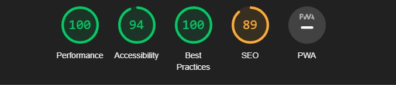
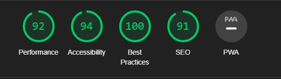
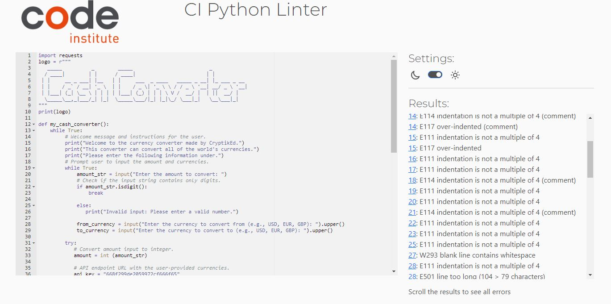
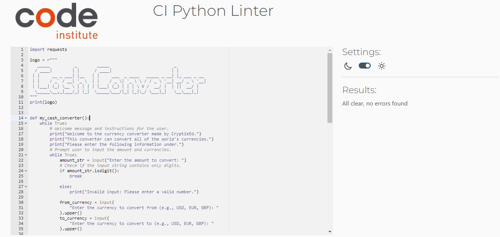

# Testing

Once the portal was functioning i set and testing for errors and editing code for new lines should appear for better user expirience.

Live link for the deployed project can be found [Here](https://cash-converter-5ca8f5523a04.herokuapp.com/) - *** Right click on link to open on new tab.***

The following tests were carried out to ensure the portal is working correctly

| **Feature**   | **Action**                    | **Expected Result**          | **Actual Result** |
| ------------- | ----------------------------- | ---------------------------- | ----------------- |
| Instructions | By opening the application | Instructions are displayed | Instructions are displayed when the application opens |
| Enter amount | By entering amount in numerical values | Amount is displayed | Amount is displayed when entering amount in correct value | 
| Invalid numerical value | User inputs symbol or letter | Error message appears | Error message appears with correct example of value, and gives option to start new conversion | 
| Enter currency *from | User inputs currency using currency code| Opens next step: Enter currency *to | Opens enter currency *to when correct code is input | 
| Enter currency *to | User inputs currency using currency code| Displays conversion results | Conversion results are displayed when correct currency *to code is input | 
| Invalid currency code| User inputs invalid symbols or numericals | Error message appears | Error message appears stating currency not supported, and gives option to start new conversion |
| Not supported currency code| User inputs currency code that is not supported | Error message appears | Error message appears with correct example of value, and gives option to start new conversion |
| Perform another conversion | User inputs yes | Starts new conversion | When entering yes, Enter amount .. is displayed |
| Perform another conversion | User inputs no | Ends program with a thank you message | When entering no, a thank you message is displayed and ends the program |

## Testing Browsers
The portal was tested in the following browsers (based on my own testing and those of people who tested the portal):

- Chrome (Works)
- Edge (Works)
- Firefox (Works)
- Opera(Works)
- Safari (Does not work on MacOS)

## Lighthouse testing

- (Desktop)

   

- (Mobile)

   

## Bugs

During setup of api key's into code i got results but was not the way i was excpecting for conversion result to appear.It appeard but never with the user input amount. Read through API provider documents and followed through and resolved.

When getting the currency code not supported, the message does not specify which currency code that is not supported its either the from or two currency code. Due to time limitation i couldn't resolve this bug, will be resolved in future.

## Validaton of code

  Validation was made through Code institute Python linter application to validate pep8 [Link here](https://pep8ci.herokuapp.com/#) 

- Before

   

- After

  

## Future Updates

- Dropdownmenu for currency codes.
- Specific error messeage that specifies unsupported currency code.
- Refactor functions into their own section to navigate easily when a problem accours or when someone is reviewing code structure.

### [BACK TO README](README.md)
